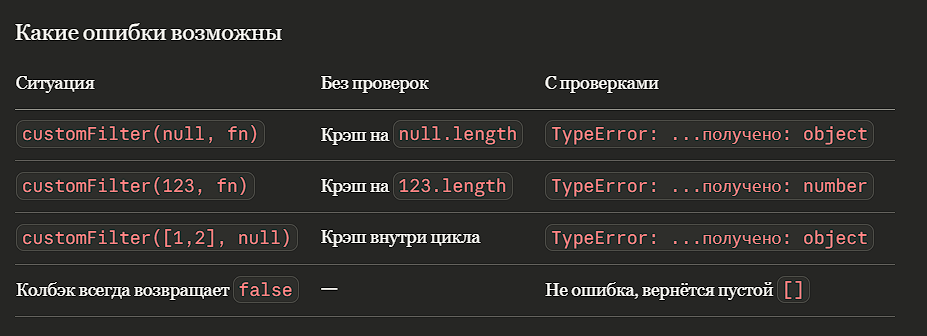
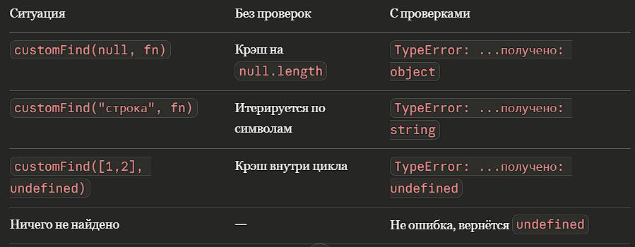
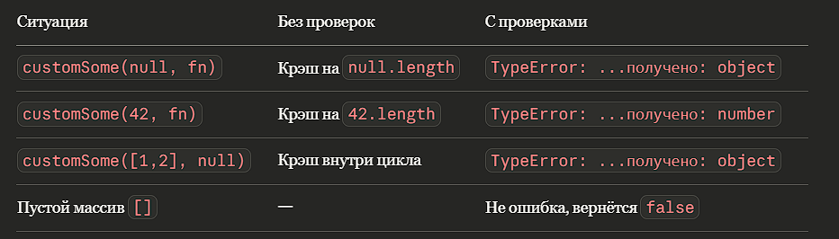
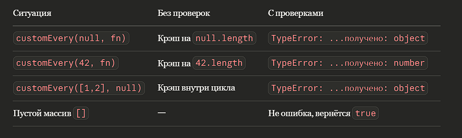

# forEach — реализация метода массива

**forEach** — *это способ пройти по каждому элементу массива и что-то с ним сделать: вывести в консоль, отправить на сервер, записать в DOM и т.д.* 

## Построчное объяснение
`function customForEach(array, callback)` - *Объявляем функцию с двумя параметрами: **array** — массив для обхода, **callback** — функция, которую нужно вызвать для каждого элемента.* 

`if (!Array.isArray(array)) {
    throw new TypeError(`Первый аргумент должен быть массивом, получено: ${typeof array}`);
}` - *Проверяем, что array действительно является массивом.* 

`if (typeof callback !== "function") {
    throw new TypeError(Второй аргумент должен быть функцией, получено: ${typeof callback});
}` - *Проверяем, что **callback** — это функция.* 

`for (let i = 0; i < array.length; i++)` - *Запускаем обычный цикл for. Переменная `i` — индекс текущего элемента. Условие `i < array.length` гарантирует, что мы не выйдем за пределы массива. `i++` — шаг итерации.* 

`callback(array[i], i, array)` - *`array[i]` — текущий элемент; 
`i` — его индекс; 
`array` — ссылка на весь массив.* 

*Нет return — функция явно возвращает undefined, как и должен forEach* 

## Какие ошибки возможны

## Почему TypeError, а не просто Error?
*TypeError — это специальный тип ошибки, который указывает на то, что значение не соответствует ожидаемому типу. В нашем случае, если кто-то передаст не массив или не функцию, это будет именно ошибка типа. Это помогает разработчикам быстрее понять, что именно пошло не так и как исправить проблему.* 

# map — реализация метода массива
**map** - *функция создает новый массив, содержащий результаты вызова колбэка для каждого элемента исходного массива. Простыми словами, map преобразует каждый элемент массива в новый элемент на основе логики, определенной в колбэке.* 

## Построчное объяснение
`function customMap(array, callback)` — *принимает массив и функцию-коллбэк* 
`if (!Array.isArray(array))` - *та же защита, что и в моем кастомном forEach* 
`if (typeof callback !== "function")` - *проверяем callback до цикла, что это функиця* 
`const result = []` - *создаём пустой массив, в который будем собирать результаты. Именно его вернём в конце.* 
`for (let i = 0; i < array.length; i++)` - *стандартный обход.* 
`result.push(callback(array[i], i, array))` - *вызываем колбэк с тремя аргументами (элемент, индекс, весь массив), и возвращаемое значение сразу кладём в `result`. Это ключевое отличие от **forEach** — нас интересует то, что вернул колбэк.* 

## Какие ошибки возможны

# filter
**filter** — *это способ отобрать только те элементы, которые соответствуют условию, и получить новый массив из них. Оригинальный массив не изменяется.*

## Построчное объяснение
`function customFilter(array, callback)` - *принимает массив и функцию которая возвращает **true** или **false*** 
`if (!Array.isArray(array))` — *защита от передачи объекта, строки, null вместо массива.* 
`if (typeof callback !== "function")` - *проверка что это функция* 
`const result = []` — *пустой массив, в который попадут только прошедшие проверку элементы.* 
`for (let i = 0; i < array.length; i++)` - *обходим каждый элемент по индексу* 
`if (callback(array[i], i, array))` - *вызываем коллбэк, если значение **truthy**, то элемент проходит фильтр, ну а если нет то нет* 
`result.push(array[i])` — *в результат кладём оригинальный элемент, а не возвращаемое значение колбэка. filter не трансформирует, а только отбирает*

## Какие ошибки возможны

# find
**find** - *функция возвращает первый элемент массива, удовлетворяющий условию.*

## Построчное объяснение
`function customFind(array, callback)` — *принимает массив и функцию* 
`if (!Array.isArray(array))` — *защита от передачи не-массива.* 
`if (typeof callback !== "function")` — *проверяем колбэк до цикла.* 
`for (let i = 0; i < array.length; i++)` — *обходим элементы по порядку* 
`if (callback(array[i], i, array))` — *если true то элемент найден* 
`return array[i]` — *немедленно возвращаем найденный элемент и прекращаем цикл. Он не продолжает перебор после первого совпадения.* 
`return undefined` — *если цикл завершился и ни один элемент не подошёл — возвращается undefined* 

## Какие ошибки возможны

# some
**some** - *Функция проверяет, существует ли хотя бы один элемент массива, удовлетворяющий условию.*

## Построчное объяснение
`function customSome(array, callback)` — *принимает массив и функцию* 
`if (!Array.isArray(array))` — *защита от передачи не-массива.* 
`if (typeof callback !== "function")` — *проверяем колбэк до цикла.* 
`for (let i = 0; i < array.length; i++)` — *обходим элементы по порядку* 
`if (callback(array[i], i, array))` - *условие выполнено если truthy* 
`return true` - *если хотя бы один элемент прошёл проверку, возвращаем true* 

## Какие ошибки возможны

#every
**every** - *функция проверяет, удовлетворяют ли все элементы массива заданному условию.*

## Построчное объяснение
`function customEvery(array, callback)` — *принимает массив и функцию* 
`if (!Array.isArray(array))` — *защита от передачи не-массива.* 
`if (typeof callback !== "function")` — *проверяем колбэк до цикла.* 
`for (let i = 0; i < array.length; i++)` — *обходим элементы по порядку* 
`if (!callback(array[i], i, array))` - *если хоть **ОДИН** элемент не подошел* 

## Какие ошибки возможны

# reduce
**reduce** - *функция последовательно обрабатывает элементы массива, накапливая результат в аккумуляторе.*

## Построчное объяснение
`function customReduce(array, callback, initialValue)` — *принимает три аргумента: массив, функцию и необязательное начальное значение аккумулятора.* 
`if (!Array.isArray(array))` — *защита от передачи не-массива.* 
`if (typeof callback !== "function")` — *проверяем колбэк до цикла.* 
`let accumulator` - *здесь находится промежуточный результат на каждом шаге цикла.* 
`let startIndex` — *индекс, с которого начнём цикл* 
`if (initialValue !== undefined)` — *проверяем, передано ли начальное значение* 
`for (let i = startIndex; i < array.length; i++)` — *цикл стартует не всегда с 0, а с `startIndex`* 
`accumulator = callback(accumulator, array[i], i, array)` - *вызываем коллбэк с четырьмя аргументами*

