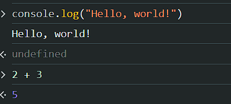
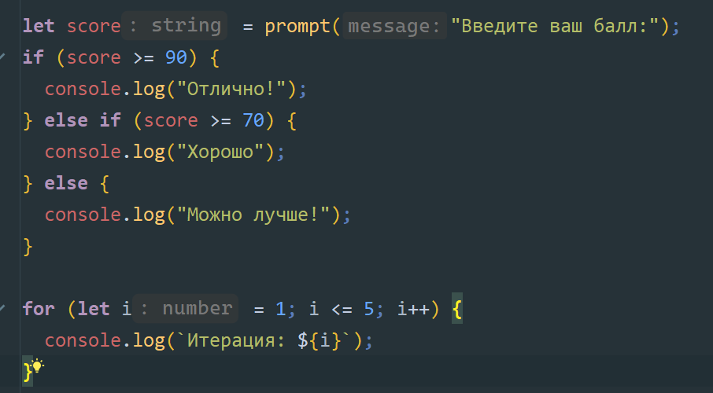

*Tcaci Eduard IA2504 Lab_1*

# Лабораторная работа №1.

## Задание номер 1: Выполнение кода в браузере

### Задание номер 1.2:  Создание первой HTML-страницы с JS
Первым делом выполняется `alert("Привет, мир!")`, 
который выводит текст и пока модальное окно не будет закрыто
следующий код не начнется. Следующим выводится `console.log()`

### Задание номер 1.3: Подключение внешнего JS-файла
`alert("Этот код выполнен из внешнего файла!");
console.log("Сообщение в консоли");`

### Задание номер 1.4: Подключение JS файла в *index.html*
``

## Задание номер 2: Работа с типами данных
Создал переменные: **name**, **birthYear**, **isStudent**
Затем, вывел их в консоль

### Задание номер 2.2: Управление потоком выполнения (условия и циклы)

### Итоги:
`var` - старый способ объявления переменных, 
`let` - новый способ, который позволяет создавать блочные переменные, 
`const` - для константных значений.

Неявное преобразование типов - это автоматическое приведение значений из одного типа данных в другой

Оператор `==` сравнивает значения, приводя их к общему типу (не рекомендовано)
Оператор `===` сравнивает значения без приведения типов (рекомендуется использовать)

